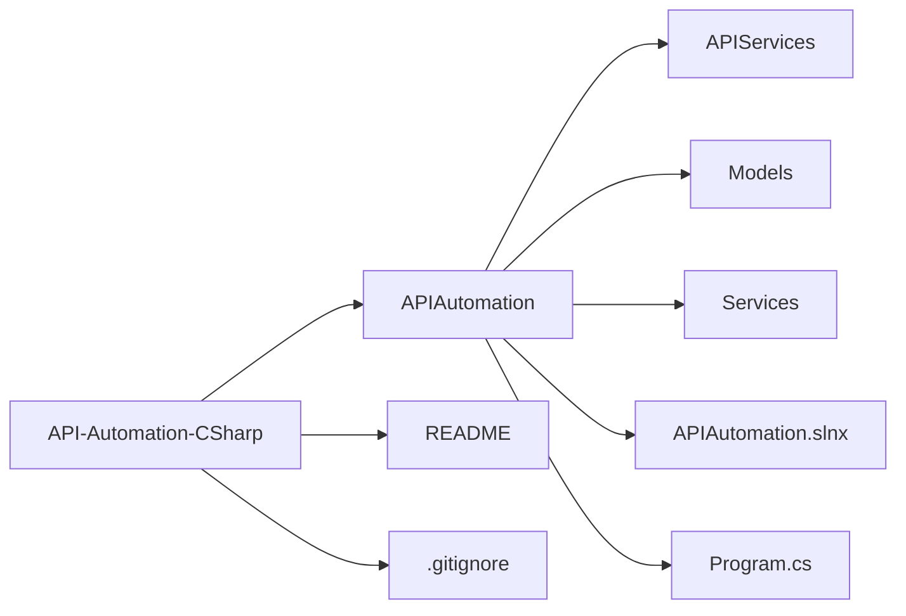

# API-Automation-CSharp

O objetivo desse repositório é automatiza os usos mais comuns de um API.
O site utilizado para essa automação é um [e-commerce playground:](https://automationexercise.com/).

## Objetivos da automação

1. **Fazer** chamadas na API de um site;
2. **Interagir** de forma que se ateste os resultados esperados;
3. **Criar** testes negativos para validar comportamento esperado;
4. **Compreender** como as API e suas requisições funcionam.

## Benefício da automação

- **Evitar** erros ao interagir com API;
- **Reduzir** o tempo para se fazer requisições;
- **Eliminar** a necessidade de interface gráfica;
- **Padronizar** o fluxo de interação com o site;
- **Possíblitar** auditar todo o processo.

## Tecnologias Utilizadas
- **C#**;
- **.NET**;
- **JSON**;
- **HttpRequest**;
- **Biblioteca Padrão**;
- **Automação RPA**.

## Checklist — Automation Exercise (API Exercises)

- [x] API 1: Get All Products List
- [x] API 2: POST To All Products List
- [x] API 3: Get All Brands List
- [x] API 4: PUT To All Brands List
- [x] API 5: POST To Search Product
- [x] API 6: POST To Search Product without search_product parameter
- [x] API 7: POST To Verify Login with valid details
- [x] API 8: POST To Verify Login without email parameter
- [x] API 9: DELETE To Verify Login
- [x] API 10: POST To Verify Login with invalid details
- [x] API 11: POST To Create/Register User Account
- [x] API 12: DELETE METHOD To Delete User Account
- [x] API 13: PUT METHOD To Update User Account
- [x] API 14: GET user account detail by email

## Arquitetura de pastas

