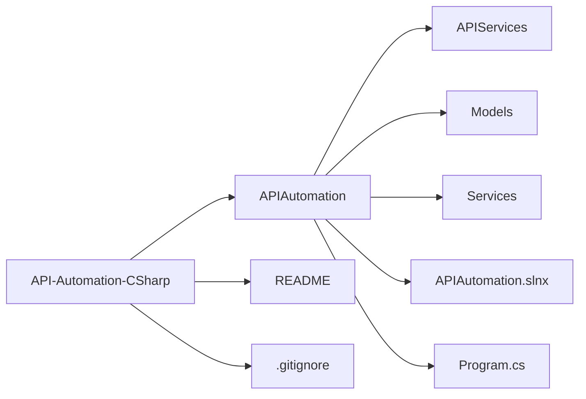

# API-Automation-CSharp

O objetivo desse repositório é automatiza os usos mais comuns de um API.
O site utilizado para essa automação é um [e-commerce playground:](https://automationexercise.com/).

## Objetivos da automação

1. **Fazer** chamadas na API de um site;
2. **Interagir** de forma que se ateste os resultados esperados;
3. **Criar** testes negativos para validar comportamento esperado;
4. **Compreender** como as API e suas requisições funcionam.

## Benefício da automação

- **Evitar** erros ao interagir com API;
- **Reduzir** o tempo para se fazer requisições;
- **Eliminar** a necessidade de interface gráfica;
- **Padronizar** o fluxo de interação com o site;
- **Possíblitar** auditar todo o processo.

## Tecnologias Utilizadas
- **C#**;
- **.NET**;
- **JSON**;
- **HttpRequest**;
- **Biblioteca Padrão**;
- **Automação RPA**.

## Checklist — Automation Exercise (API Exercises)

- [x] API 1: Get All Products List
- [x] API 2: POST To All Products List
- [x] API 3: Get All Brands List
- [x] API 4: PUT To All Brands List
- [x] API 5: POST To Search Product
- [x] API 6: POST To Search Product without search_product parameter
- [x] API 7: POST To Verify Login with valid details
- [x] API 8: POST To Verify Login without email parameter
- [x] API 9: DELETE To Verify Login
- [x] API 10: POST To Verify Login with invalid details
- [x] API 11: POST To Create/Register User Account
- [x] API 12: DELETE METHOD To Delete User Account
- [x] API 13: PUT METHOD To Update User Account
- [x] API 14: GET user account detail by email

## Arquitetura de pastas

## API Tests

## API Test Case 01 — Get All Products List

Este cenário valida a API responsável por retornar a lista completa de produtos disponíveis no sistema.

### Objectivo

Validar a requisição **GET para listar todos os produtos**, garantindo:

- Execução correta da requisição HTTP GET  
- Retorno do Status Code esperado  
- Estrutura válida da resposta JSON  
- Presença da lista completa de produtos  

### Pré-condição

- A API deve estar acessível em:  
  `https://automationexercise.com/api/productsList`
- O método HTTP utilizado deve ser **GET**
- A conexão com a internet deve estar ativa  

### Passo a passo do test

1. Configurar uma requisição HTTP com método **GET**  
2. Definir a URL como:  
   `https://automationexercise.com/api/productsList`  
3. Enviar a requisição  
4. Verificar se o **Status Code retornado é 200**  
5. Verificar se o corpo da resposta está no formato **JSON válido**  
6. Confirmar que a resposta contém a chave **products**  
7. Confirmar que a lista **products** contém pelo menos um item  
8. Validar que cada item da lista possui os seguintes campos:
   - id  
   - name  
   - price  
   - brand  
   - category  
9. Confirmar que não há mensagem de erro na resposta  

### Resultado Esperado

- Status Code **200 OK**  
- Corpo da resposta em formato JSON válido  
- Lista de produtos retornada com sucesso  
- Estrutura de dados consistente  
- Nenhum erro na resposta  

## API Test Case 02 — POST To All Products List

Este cenário valida o comportamento da API ao tentar utilizar o método HTTP incorreto (POST) no endpoint destinado à listagem de produtos, que aceita apenas requisições GET.

### Objectivo

Validar a restrição de método HTTP na API **productsList**, garantindo:

- Rejeição do método POST  
- Retorno do Status Code apropriado  
- Exibição da mensagem de erro correta  

### Pré-condição

- A API deve estar acessível em:  
  `https://automationexercise.com/api/productsList`  
- A conexão com a internet deve estar ativa  
- A requisição deve utilizar o método **POST**  

### Passo a passo do test

1. Configurar uma requisição HTTP com método **POST**  
2. Definir a URL como:  
   `https://automationexercise.com/api/productsList`  
3. Não enviar parâmetros no corpo da requisição  
4. Enviar a requisição  
5. Verificar o **Status Code retornado**  
6. Verificar o corpo da resposta  
7. Confirmar que a resposta contém a mensagem indicando método não suportado  

### Resultado Esperado

- Status Code **405 Method Not Allowed**  
- Corpo da resposta em formato JSON  
- Mensagem retornada:  
  `"This request method is not supported."`  
- Nenhum dado de produto é retornado  

## API Test Case 03 — Get All Brands List

Este cenário valida a API responsável por retornar a lista completa de marcas (brands) disponíveis no sistema.

### Objectivo

Validar a requisição **GET para listar todas as marcas**, garantindo:

- Execução correta da requisição HTTP GET  
- Retorno do Status Code esperado  
- Estrutura válida da resposta JSON  
- Presença da lista de marcas na resposta  

### Pré-condição

- A API deve estar acessível em:  
  `https://automationexercise.com/api/brandsList`
- O método HTTP utilizado deve ser **GET**
- A conexão com a internet deve estar ativa  

### Passo a passo do test

1. Configurar uma requisição HTTP com método **GET**  
2. Definir a URL como:  
   `https://automationexercise.com/api/brandsList`  
3. Enviar a requisição  
4. Verificar se o **Status Code retornado é 200**  
5. Verificar se o corpo da resposta está no formato **JSON válido**  
6. Confirmar que a resposta contém a chave **brands**  
7. Confirmar que a lista **brands** contém pelo menos um item  
8. Validar que cada item da lista possui os seguintes campos:
   - id  
   - brand  
9. Confirmar que não há mensagem de erro na resposta  

### Resultado Esperado

- Status Code **200 OK**  
- Corpo da resposta em formato JSON válido  
- Lista de marcas retornada com sucesso  
- Estrutura de dados consistente (campos **id** e **brand**)  
- Nenhum erro na resposta  

## API Test Case 04 — PUT To All Brands List

Este cenário valida o comportamento da API ao tentar utilizar o método HTTP incorreto (PUT) no endpoint destinado à listagem de marcas, que aceita apenas requisições GET.

### Objectivo

Validar a restrição de método HTTP na API **brandsList**, garantindo:

- Rejeição do método PUT  
- Retorno do Status Code apropriado  
- Exibição da mensagem de erro correta  

### Pré-condição

- A API deve estar acessível em:  
  `https://automationexercise.com/api/brandsList`  
- A conexão com a internet deve estar ativa  
- A requisição deve utilizar o método **PUT**  

### Passo a passo do test

1. Configurar uma requisição HTTP com método **PUT**  
2. Definir a URL como:  
   `https://automationexercise.com/api/brandsList`  
3. Não enviar parâmetros no corpo da requisição  
4. Enviar a requisição  
5. Verificar o **Status Code retornado**  
6. Verificar o corpo da resposta  
7. Confirmar que a resposta contém a mensagem indicando método não suportado  

### Resultado Esperado

- Status Code **405 Method Not Allowed**  
- Corpo da resposta em formato JSON  
- Mensagem retornada:  
  `"This request method is not supported."`  
- Nenhuma lista de marcas é retornada  

## API Test Case 05 — POST To Search Product

Este cenário valida a API responsável por realizar busca de produtos com base em um termo informado pelo usuário.

### Objectivo

Validar a requisição **POST para buscar produtos**, garantindo:

- Envio correto do parâmetro de busca  
- Retorno do Status Code esperado  
- Estrutura válida da resposta JSON  
- Retorno apenas dos produtos correspondentes ao termo pesquisado  

### Pré-condição

- A API deve estar acessível em:  
  `https://automationexercise.com/api/searchProduct`
- O método HTTP utilizado deve ser **POST**
- O parâmetro obrigatório **search_product** deve ser informado  
- A conexão com a internet deve estar ativa  

### Passo a passo do test

1. Configurar uma requisição HTTP com método **POST**  
2. Definir a URL como:  
   `https://automationexercise.com/api/searchProduct`  
3. Definir o header:
   - Content-Type: application/x-www-form-urlencoded  
4. Informar no corpo da requisição o parâmetro:
   - search_product = (nome de produto válido)  
5. Enviar a requisição  
6. Verificar se o **Status Code retornado é 200**  
7. Verificar se o corpo da resposta está no formato **JSON válido**  
8. Confirmar que a resposta contém a chave **products**  
9. Confirmar que a lista **products** contém pelo menos um item  
10. Validar que os produtos retornados correspondem ao termo pesquisado  
11. Confirmar que não há mensagem de erro na resposta  

### Resultado Esperado

- Status Code **200 OK**  
- Corpo da resposta em formato JSON válido  
- Lista de produtos correspondente ao termo pesquisado  
- Estrutura de dados consistente  
- Nenhum erro na resposta  

## API Test Case 06 — POST To Search Product Without Search Parameter

Este cenário valida o comportamento da API quando a requisição de busca de produto é enviada sem o parâmetro obrigatório **search_product**.

### Objectivo

Validar a obrigatoriedade do parâmetro **search_product**, garantindo:

- Rejeição da requisição sem o parâmetro obrigatório  
- Retorno do Status Code apropriado  
- Exibição da mensagem de erro correta  

### Pré-condição

- A API deve estar acessível em:  
  `https://automationexercise.com/api/searchProduct`
- O método HTTP utilizado deve ser **POST**
- A conexão com a internet deve estar ativa  
- O parâmetro **search_product** não deve ser enviado  

### Passo a passo do test

1. Configurar uma requisição HTTP com método **POST**  
2. Definir a URL como:  
   `https://automationexercise.com/api/searchProduct`  
3. Definir o header:
   - Content-Type: application/x-www-form-urlencoded  
4. Não enviar o parâmetro **search_product** no corpo da requisição  
5. Enviar a requisição  
6. Verificar o **Status Code retornado**  
7. Verificar o corpo da resposta  
8. Confirmar que a resposta contém mensagem indicando ausência do parâmetro obrigatório  

### Resultado Esperado

- Status Code **400 Bad Request**  
- Corpo da resposta em formato JSON  
- Mensagem retornada indicando que o parâmetro é obrigatório  
- Nenhuma lista de produtos é retornada  

## API Test Case 07 — POST To Verify Login with Valid Details

Este cenário valida a API responsável por verificar o login de um usuário utilizando credenciais válidas.

### Objectivo

Validar a requisição **POST para verificação de login com credenciais válidas**, garantindo:

- Envio correto dos parâmetros obrigatórios  
- Retorno do Status Code esperado  
- Retorno da mensagem de sucesso  
- Confirmação de autenticação válida  

### Pré-condição

- A API deve estar acessível em:  
  `https://automationexercise.com/api/verifyLogin`
- O método HTTP utilizado deve ser **POST**
- A conexão com a internet deve estar ativa  
- Deve existir um usuário previamente cadastrado  
- Os parâmetros obrigatórios devem ser informados:
  - email  
  - password  

### Passo a passo do test

1. Configurar uma requisição HTTP com método **POST**  
2. Definir a URL como:  
   `https://automationexercise.com/api/verifyLogin`  
3. Definir o header:
   - Content-Type: application/x-www-form-urlencoded  
4. Informar no corpo da requisição os parâmetros:
   - email = (e-mail válido cadastrado)  
   - password = (senha correta)  
5. Enviar a

## API Test Case 08 — POST To Verify Login without Email Parameter

Este cenário valida o comportamento da API quando a requisição de verificação de login é enviada sem o parâmetro obrigatório **email**.

### Objectivo

Validar a obrigatoriedade do parâmetro **email**, garantindo:

- Rejeição da requisição sem o parâmetro obrigatório  
- Retorno do Status Code apropriado  
- Exibição da mensagem de erro correta  

### Pré-condição

- A API deve estar acessível em:  
  `https://automationexercise.com/api/verifyLogin`
- O método HTTP utilizado deve ser **POST**
- A conexão com a internet deve estar ativa  
- O parâmetro obrigatório **email** não deve ser enviado  
- O parâmetro **password** pode ser enviado  

### Passo a passo do test

1. Configurar uma requisição HTTP com método **POST**  
2. Definir a URL como:  
   `https://automationexercise.com/api/verifyLogin`  
3. Definir o header:
   - Content-Type: application/x-www-form-urlencoded  
4. Informar no corpo da requisição apenas o parâmetro:
   - password = (qualquer valor)  
5. Não enviar o parâmetro **email**  
6. Enviar a requisição  
7. Verificar o **Status Code retornado**  
8. Verificar o corpo da resposta  
9. Confirmar que a resposta contém mensagem indicando ausência do parâmetro obrigatório  

### Resultado Esperado

- Status Code **400 Bad Request**  
- Corpo da resposta em formato JSON  
- Mensagem retornada indicando que o parâmetro email é obrigatório  
- Nenhuma autenticação é realizada  

## API Test Case 09 — DELETE To Verify Login

Este cenário valida o comportamento da API ao tentar utilizar o método HTTP incorreto (DELETE) no endpoint de verificação de login, que aceita apenas requisições POST.

### Objectivo

Validar a restrição de método HTTP na API **verifyLogin**, garantindo:

- Rejeição do método DELETE  
- Retorno do Status Code apropriado  
- Exibição da mensagem de erro correta  

### Pré-condição

- A API deve estar acessível em:  
  `https://automationexercise.com/api/verifyLogin`
- A conexão com a internet deve estar ativa  
- A requisição deve utilizar o método **DELETE**  

### Passo a passo do test

1. Configurar uma requisição HTTP com método **DELETE**  
2. Definir a URL como:  
   `https://automationexercise.com/api/verifyLogin`  
3. Não enviar parâmetros no corpo da requisição  
4. Enviar a requisição  
5. Verificar o **Status Code retornado**  
6. Verificar o corpo da resposta  
7. Confirmar que a resposta contém mensagem indicando método não suportado  

### Resultado Esperado

- Status Code **405 Method Not Allowed**  
- Corpo da resposta em formato JSON  
- Mensagem retornada:  
  `"This request method is not supported."`  
- Nenhuma verificação de login é realizada  

## API Test Case 10 — POST To Verify Login with Invalid Details

Este cenário valida o comportamento da API ao tentar verificar login utilizando credenciais inválidas.

### Objectivo

Validar a verificação de login com **credenciais incorretas**, garantindo:

- Envio correto dos parâmetros obrigatórios  
- Retorno do Status Code esperado  
- Retorno da mensagem indicando falha de autenticação  
- Não autenticação do usuário  

### Pré-condição

- A API deve estar acessível em:  
  `https://automationexercise.com/api/verifyLogin`
- O método HTTP utilizado deve ser **POST**
- A conexão com a internet deve estar ativa  
- Os parâmetros obrigatórios devem ser informados:
  - email  
  - password  
- As credenciais enviadas devem ser inválidas  

### Passo a passo do test

1. Configurar uma requisição HTTP com método **POST**  
2. Definir a URL como:  
   `https://automationexercise.com/api/verifyLogin`  
3. Definir o header:
   - Content-Type: application/x-www-form-urlencoded  
4. Informar no corpo da requisição:
   - email = (e-mail inválido ou não cadastrado)  
   - password = (senha incorreta)  
5. Enviar a requisição  
6. Verificar se o **Status Code retornado é 200**  
7. Verificar se o corpo da resposta está em formato **JSON válido**  
8. Confirmar que a resposta contém:
   - responseCode  
   - message  
9. Confirmar que a mensagem indica falha na autenticação  

### Resultado Esperado

- Status Code **200 OK**  
- Corpo da resposta em formato JSON válido  
- responseCode indicando falha  
- Mensagem retornada informando que o usuário não foi encontrado ou credenciais inválidas  
- Nenhuma autenticação é realizada  

## API Test Case 11 — POST To Create/Register User Account

Este cenário valida a API responsável por criar uma nova conta de usuário no sistema.

### Objectivo

Validar a requisição **POST para criação de nova conta**, garantindo:

- Envio correto de todos os parâmetros obrigatórios  
- Retorno do Status Code esperado  
- Confirmação de criação da conta  
- Estrutura válida da resposta JSON  

### Pré-condição

- A API deve estar acessível em:  
  `https://automationexercise.com/api/createAccount`
- O método HTTP utilizado deve ser **POST**
- A conexão com a internet deve estar ativa  
- O e-mail utilizado não deve estar previamente cadastrado  
- Todos os parâmetros obrigatórios devem ser informados  

### Parâmetros obrigatórios

- name  
- email  
- password  
- title  
- birth_date  
- birth_month  
- birth_year  
- firstname  
- lastname  
- company  
- address1  
- address2  
- country  
- zipcode  
- state  
- city  
- mobile_number  

### Passo a passo do test

1. Configurar uma requisição HTTP com método **POST**  
2. Definir a URL como:  
   `https://automationexercise.com/api/createAccount`  
3. Definir o header:
   - Content-Type: application/x-www-form-urlencoded  
4. Informar no corpo da requisição todos os parâmetros obrigatórios com valores válidos  
5. Enviar a requisição  
6. Verificar se o **Status Code retornado é 200**  
7. Verificar se o corpo da resposta está em formato **JSON válido**  
8. Confirmar que a resposta contém:
   - responseCode  
   - message  
9. Confirmar que a mensagem indica criação de conta com sucesso  

### Resultado Esperado

- Status Code **200 OK**  
- Corpo da resposta em formato JSON válido  
- responseCode indicando sucesso  
- Mensagem retornada:  
  `"User created!"`  
- A conta é criada com sucesso no sistema  

## API Test Case 12 — DELETE METHOD To Delete User Account

Este cenário valida a API responsável por excluir uma conta de usuário existente no sistema.

### Objectivo

Validar a requisição **DELETE para exclusão de conta**, garantindo:

- Envio correto dos parâmetros obrigatórios  
- Retorno do Status Code esperado  
- Confirmação de exclusão da conta  
- Estrutura válida da resposta JSON  

### Pré-condição

- A API deve estar acessível em:  
  `https://automationexercise.com/api/deleteAccount`
- O método HTTP utilizado deve ser **DELETE**
- A conexão com a internet deve estar ativa  
- Deve existir uma conta previamente cadastrada  
- Os parâmetros obrigatórios devem ser informados:
  - email  
  - password  

### Passo a passo do test

1. Configurar uma requisição HTTP com método **DELETE**  
2. Definir a URL como:  
   `https://automationexercise.com/api/deleteAccount`  
3. Definir o header:
   - Content-Type: application/x-www-form-urlencoded  
4. Informar no corpo da requisição os parâmetros:
   - email = (e-mail válido cadastrado)  
   - password = (senha correta)  
5. Enviar a requisição  
6. Verificar se o **Status Code retornado é 200**  
7. Verificar se o corpo da resposta está em formato **JSON válido**  
8. Confirmar que a resposta contém:
   - responseCode  
   - message  
9. Confirmar que a mensagem indica exclusão da conta com sucesso  

### Resultado Esperado

- Status Code **200 OK**  
- Corpo da resposta em formato JSON válido  
- responseCode indicando sucesso  
- Mensagem retornada:  
  `"Account deleted!"`  
- A conta é removida do sistema com sucesso  

## API Test Case 13 — PUT METHOD To Update User Account

Este cenário valida a API responsável por atualizar os dados de uma conta de usuário existente no sistema.

### Objectivo

Validar a requisição **PUT para atualização de conta**, garantindo:

- Envio correto dos parâmetros obrigatórios  
- Atualização bem-sucedida dos dados do usuário  
- Retorno do Status Code esperado  
- Estrutura válida da resposta JSON  

### Pré-condição

- A API deve estar acessível em:  
  `https://automationexercise.com/api/updateAccount`
- O método HTTP utilizado deve ser **PUT**
- A conexão com a internet deve estar ativa  
- Deve existir uma conta previamente cadastrada  
- Os parâmetros obrigatórios devem ser informados  

### Parâmetros obrigatórios

- name  
- email  
- password  
- title  
- birth_date  
- birth_month  
- birth_year  
- firstname  
- lastname  
- company  
- address1  
- address2  
- country  
- zipcode  
- state  
- city  
- mobile_number  

### Passo a passo do test

1. Configurar uma requisição HTTP com método **PUT**  
2. Definir a URL como:  
   `https://automationexercise.com/api/updateAccount`  
3. Definir o header:
   - Content-Type: application/x-www-form-urlencoded  
4. Informar no corpo da requisição todos os parâmetros obrigatórios com valores atualizados  
5. Enviar a requisição  
6. Verificar se o **Status Code retornado é 200**  
7. Verificar se o corpo da resposta está em formato **JSON válido**  
8. Confirmar que a resposta contém:
   - responseCode  
   - message  
9. Confirmar que a mensagem indica atualização bem-sucedida da conta  

### Resultado Esperado

- Status Code **200 OK**  
- Corpo da resposta em formato JSON válido  
- responseCode indicando sucesso  
- Mensagem retornada:  
  `"User updated!"`  
- Os dados da conta são atualizados com sucesso no sistema  

## API Test Case 14 — GET USER ACCOUNT DETAIL BY EMAIL

Este cenário valida a API responsável por retornar os detalhes de uma conta de usuário com base no e-mail informado.

### Objectivo

Validar a requisição **GET para obter detalhes da conta por e-mail**, garantindo:

- Envio correto do parâmetro obrigatório  
- Retorno do Status Code esperado  
- Estrutura válida da resposta JSON  
- Retorno correto dos dados do usuário  

### Pré-condição

- A API deve estar acessível em:  
  `https://automationexercise.com/api/getUserDetailByEmail`
- O método HTTP utilizado deve ser **GET**
- A conexão com a internet deve estar ativa  
- Deve existir uma conta previamente cadastrada  
- O parâmetro obrigatório deve ser informado:
  - email  

### Passo a passo do test

1. Configurar uma requisição HTTP com método **GET**  
2. Definir a URL como:  
   `https://automationexercise.com/api/getUserDetailByEmail?email=(e-mail válido cadastrado)`  
3. Enviar a requisição  
4. Verificar se o **Status Code retornado é 200**  
5. Verificar se o corpo da resposta está em formato **JSON válido**  
6. Confirmar que a resposta contém:
   - responseCode  
   - user  
7. Validar que o objeto **user** contém os seguintes campos:
   - name  
   - email  
   - title  
   - birth_date  
   - birth_month  
   - birth_year  
   - firstname  
   - lastname  
   - company  
   - address1  
   - address2  
   - country  
   - zipcode  
   - state  
   - city  
   - mobile_number  
8. Confirmar que o e-mail retornado corresponde ao e-mail informado na requisição  

### Resultado Esperado

- Status Code **200 OK**  
- Corpo da resposta em formato JSON válido  
- responseCode indicando sucesso  
- Objeto **user** retornado corretamente  
- Todos os dados correspondem ao usuário informado  
- Nenhum erro ocorre durante a requisição  
